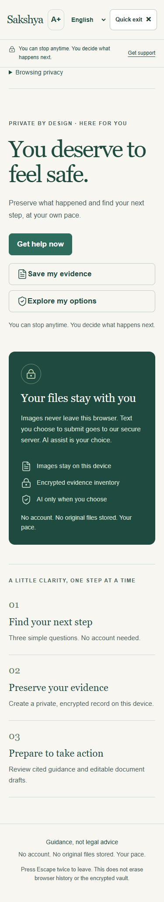
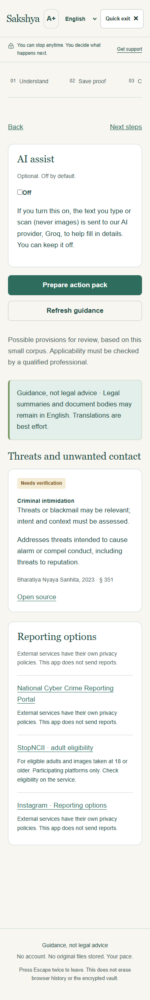
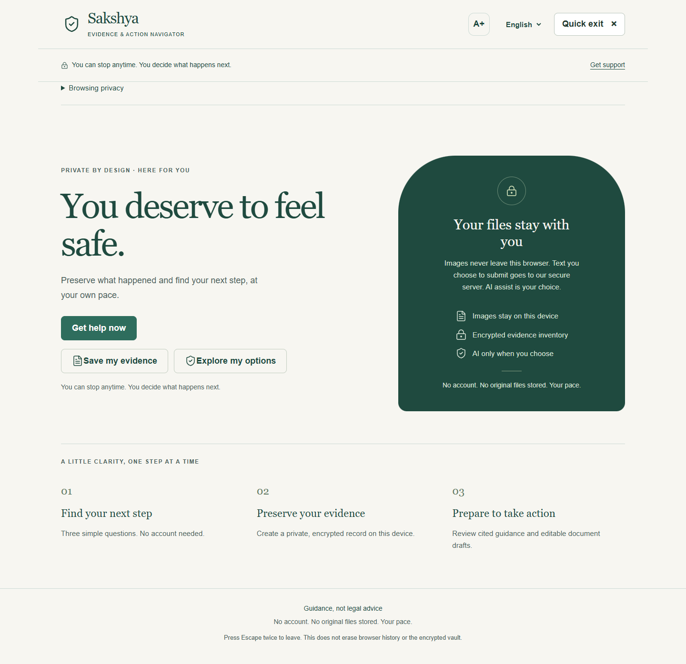

# Sakshya — Evidence & Action Navigator

A runnable, local prototype for people in India facing online harassment or image-based abuse. It moves from a calm triage to a private evidence inventory, cited guidance, and editable documents. **Guidance, not legal advice.** The app does not file reports, establish guilt, or guarantee court admissibility.

##Deployed Link: https://sakshya-two.vercel.app/

## Start on Windows 11 / PowerShell

Prerequisites: Python 3.11+ and a current Node.js LTS release (Node 22+ recommended). Tested here with Python 3.13 and Node 24. The Python virtual environment lives at `Backend\.venv`.

Open two PowerShell terminals. Start the backend first:

```powershell
cd D:\ChhatGPT\SheSolves_Proto
powershell -ExecutionPolicy Bypass -File .\run_backend.ps1
```

In the second terminal:

```powershell
cd D:\ChhatGPT\SheSolves_Proto
powershell -ExecutionPolicy Bypass -File .\run_frontend.ps1
```

Open **http://localhost:3000**. Keep both terminals open; Ctrl+C stops each server. The scripts install missing dependencies and copy example environment files. No API key is needed. First setup requires Internet access for packages and OCR language assets; subsequent mock-provider operation can run without Internet. No external service is needed for the vault.

The backend uses port **8000**, frontend **3000**. An existing nginx service occupies IPv4 port 8000 on this machine. The backend script automatically falls back to the IPv6 loopback address `::1` on **the same port** and records it in `Backend/.runtime-host`; the frontend script reads this and sets `NEXT_PUBLIC_API_URL=http://[::1]:8000`. It never stops unrelated programs. If both addresses are occupied, the script explains the conflict. Use `http://localhost:3000` for CORS, rather than opening the frontend through another hostname.

### Manual setup

```powershell
cd D:\ChhatGPT\SheSolves_Proto\Backend
python -m venv .venv
.\.venv\Scripts\python.exe -m pip install -r requirements.txt
Copy-Item .env.example .env
.\.venv\Scripts\python.exe -m uvicorn app.main:app --host 127.0.0.1 --port 8000 --no-access-log --log-level critical
# On this machine use --host ::1 because IPv4 port 8000 is occupied.
```

```powershell
cd D:\ChhatGPT\SheSolves_Proto\Frontend
npm.cmd ci
npm.cmd run prepare:ocr
Copy-Item .env.example .env.local
# Set NEXT_PUBLIC_API_URL=http://[::1]:8000 in .env.local for IPv6.
npm.cmd run dev
```

### Production build and offline PWA

Stop the development frontend before building (both use `.next`). Keep the backend running.

```powershell
cd D:\ChhatGPT\SheSolves_Proto\Frontend
npm.cmd run build
npm.cmd start
```

The production build generates a public asset inventory and registers the service worker. Load the app once and wait for the service worker to finish installing before going offline. The cache contains only the application shell, code, icons, local fonts, image preprocessing worker, OCR worker/WASM, English/Hindi/Marathi language data and the four neutral local pages. API responses, POST bodies, images and evidence files are never cached. Development mode deliberately does not register the service worker. Browser install options vary. Localhost is a secure context for Web Crypto and service workers; remote hosting would need HTTPS.

## Architecture and code tour

```text
Browser (Next.js App Router / TypeScript / Tailwind)
  file bytes -> Web Crypto SHA-256 -> metadata only
  up to 5 screenshots -> local preprocessing worker -> Tesseract -> editable OCR text
  passphrase -> PBKDF2 -> AES-GCM key -> encrypted Dexie record
  explicit text / metadata actions -> FastAPI (no database)
    extract -> mock rules or configured text-only provider
    guidance -> in-memory corpus retrieval -> constrained explanations
    draft/pdf -> deterministic templates -> ReportLab in-memory PDF
```

| File / directory | Purpose |
| --- | --- |
| `Frontend/app/page.tsx` | Triage, vault, OCR, details, guidance, documents and checklist flow |
| `Frontend/app/globals.css` | Responsive green/off-white design, focus states and touch targets |
| `Frontend/lib/chain.ts` | Pure SHA-256 timeline construction and first-broken-link detection |
| `Frontend/lib/vault.ts` | Dexie database with encrypted metadata records only |
| `Frontend/lib/i18n.tsx`, `locales/` | English, Hindi and Marathi context; no language URL routing |
| `Frontend/public/ocr/` | Local worker, WASM and language data; no OCR CDN calls at runtime |
| `Frontend/public/sw.js` | Application-assets-only offline cache |
| `Backend/app/main.py` | FastAPI, CORS, body limits, no-store headers and scrubbed errors |
| `Backend/app/schemas.py` | Pydantic v2 text/metadata schemas, strict extra-field rejection |
| `Backend/app/llm.py` | Groq, mock and optional provider wrappers; strict grounded output |
| `Backend/app/rag.py` | Corpus-only multilingual model / TF-IDF retrieval |
| `Backend/app/pdfgen.py` | Editable draft templates and ReportLab PDF rendering |
| `Backend/app/routers/api.py` | Requested API endpoints |
| `Backend/corpus/` | 18 paraphrased legal provisions and reporting route corpus |
| `Backend/tests/`, `Frontend/lib/chain.test.ts`, `Frontend/e2e/` | API, chain and browser tests |

## Privacy model

- Files are read in browser memory for hashing or OCR, then released; originals are never persisted by the app or uploaded. The file picker may retain a selection until the action finishes. Keep originals yourself.
- The vault stores only a salt, fresh IV and AES-GCM ciphertext in IndexedDB. The payload contains the timeline metadata and hashes. The key is derived using PBKDF2, **200,000 iterations**, SHA-256, a random 16-byte salt, and AES-256-GCM with a fresh 12-byte IV for each save. The key/passphrase are not persisted. A wrong passphrase fails authenticated decryption; no recovery service exists.
- Case forms, OCR text, guidance and drafts live in memory. Refresh or lock clears them. Only locale, checklist completion flags and the AI-assist boolean are saved unencrypted in localStorage. A neutral previous-exit URL is retained in sessionStorage.
- Demo metadata is encrypted in a **separate** IndexedDB record. Tamper simulation changes only the synthetic record. Leaving demo restores the real timeline. Clicking Demo mode again resets the synthetic chain.
- Backend data is request-scoped and discarded after the response. No database or request-body log exists. Python logging is disabled; start uvicorn with access logs disabled. HTTP validation errors do not echo inputs. Proxies/debuggers outside this application can have separate logging behavior.
- Extraction and guidance send edited text only. Draft/PDF generation also sends hashes and metadata (including file names) to our configured server. Only when AI assist is on, extraction text, guidance scenario text and supplied statement facts can go to the configured provider; files/images do not. Provider retention policies are outside this app.
- Generated PDF downloads are **unencrypted**. Store them securely. Quick Exit uses `location.replace` to a neutral site and clears live state; it does not erase browser history, existing downloads, screenshots, or the encrypted vault. Press Escape twice within 1.2 seconds to trigger it.

## Hash chain

Each entry contains `index`, ISO timestamp, `fileName`, `fileHash`, `platform`, `note`, `prevHash`, `entryHash`.

```text
entryHash = SHA256(index|timestamp|fileName|fileHash|platform|note|prevHash)
first prevHash = 64 zeros
```

The implementation rejects `|` in free-text chain fields to avoid ambiguous serialization. Verification checks the ordinal, previous link and recomputed entry digest. It rereads encrypted storage before verification, rather than checking only a stale UI copy. A local chain detects modifications relative to its recorded state; it cannot prove time, source authenticity or protect against an attacker who rewrites the whole chain, deletes its tail, or controls the unlocked device. Export and independently retain a trusted digest/inventory if appropriate. This is not a notarization or court certification service.

## Legal corpus and reporting routes

**Read `Backend/corpus/README.md` before any demonstration.** Every provision has an act, section, source link, plain paraphrase and `needs_verification: true`. No fabricated statutory quotes are used. Retrieval can only return corpus IDs. An unrelated query returns no provisions. Minor mode includes appropriate POCSO items and Take It Down instead of suggesting StopNCII eligibility. The Help panel keeps both services clearly labelled.

RAG defaults to `auto`: try the locally cached `paraphrase-multilingual-MiniLM-L12-v2` model, otherwise use scikit-learn character TF-IDF. Set `RAG_MODE=transformer` to allow a first model download (inside `Backend/.model-cache`), or `RAG_MODE=tfidf` for deterministic offline startup. Similarities use numpy; no vector database exists. A keyword gate reduces unrelated results, but is intentionally conservative and can miss paraphrases or multilingual variants. Do not treat no match as no remedy.

The LLM selects **only prewritten corpus explanation choices**. It cannot add a provision, source URL or new legal explanation. This is a deliberate safeguard against uncited model output. Templates are deterministic and editable. Section 63 output includes party and expert preparation fields and all evidence hashes; it is a **preparation worksheet**, not the completed official Schedule. Have a qualified person verify and complete the required form. Legal summaries and document bodies can remain English, visibly disclosed; interface strings and PDF titles are translated. The bundled Noto Sans Devanagari font and HarfBuzz provide PDF glyphs and shaping on Windows and Linux. The same font is served locally to the frontend under its OFL license.

## Optional LLM credentials

Copy `Backend/.env.example` to `.env`, set `LLM_PROVIDER` to `groq`, `openai`, `anthropic`, `gemini` or `mock`, and fill the matching key. Never put provider keys in a frontend environment variable.

```dotenv
LLM_PROVIDER=mock
GROQ_API_KEY=
GROQ_MODEL=openai/gpt-oss-120b
AI_REQUESTS_PER_MINUTE=10
OPENAI_API_KEY=
ANTHROPIC_API_KEY=
GEMINI_API_KEY=
LLM_MODEL=
RAG_MODE=auto
```

The requested provider without its key falls back to mock. Provider errors also fall back without logging request content. `LLM_MODEL` overrides provider defaults. Paid-provider calls were not exercised with credentials during the synthetic demonstration.

## API

| Method | Path | Behavior |
| --- | --- | --- |
| GET | `/health` | `{"status":"ok"}` |
| GET | `/api/ai/status` | Provider and configured availability; no credential values |
| POST | `/api/extract` | `{text,lang,ai_assist}` -> platform, usernames, URLs, phones, dates, threat type, summary and confidence |
| POST | `/api/draft/statement` | `{case,lang,ai_assist}` -> grounded editable statement and review label |
| POST | `/api/guidance` | `{scenario,details,lang,is_minor}` -> cited provisions, routes, disclaimer |
| POST | `/api/draft` | `{kind,case,evidence,lang}` -> title and editable body |
| POST | `/api/pdf` | Same request, optional `edited_body`, returns PDF bytes |
| GET | `/api/helplines` | Sourced 112 / 181 / 1098 and reporting resources |

`kind` is `complaint`, `takedown`, `section63`, or the additional `timeline` export. `case` contains platform, usernames (string), dates (string), description, accused, scenario, is_minor, statement. `evidence` uses the chain entry format above. `lang` is `en`, `hi` or `mr`. Maximum request body: 2 MB, text: 12,000 characters, evidence: 200 entries, browser file size: 25 MB. Unknown fields (including image/file payload fields) are rejected. PDFs use escaped plain text, never executable HTML.

## Synthetic demo script

1. Choose **Get help now**. Select threats, no immediate danger, and adult. Separately test Yes danger/Yes minor to see emergency-first support and cited POCSO context.
2. Create a vault with a demo-only passphrase of at least 12 characters. Select **Demo mode**.
3. Click **Verify chain**: all links pass. Click **Simulate tampering**, then verify: entry 1 is highlighted as broken. Reload Demo mode to restore the synthetic timeline. Download its PDF.
4. Continue to details. Use only a synthetic screenshot of text. Choose English, Hindi or Marathi, run OCR locally, review/edit the text, then explicitly extract details. Edit any field.
5. Find guidance. Each card must have a citation, source link and verification flag. Check the reporting options.
6. Create each of the three drafts. Edit the preview and download a PDF. Confirm hashes in the evidence inventory and blanks in the certificate preparation draft.
7. Switch languages. The interface and new PDF headings change. Tick a next-step item and reload to confirm checklist persistence.
8. Lock and unlock with the passphrase. A wrong passphrase must fail. Quick Exit and double Escape should leave for the neutral site.

## Tests

```powershell
cd D:\ChhatGPT\SheSolves_Proto\Backend
.\.venv\Scripts\python.exe -m pytest -q
cd ..\Frontend
npm.cmd test
npm.cmd run typecheck
# Both servers must be running; uses installed Microsoft Edge headlessly.
npx.cmd playwright test
```

The browser suite uses synthetic text/PNG data, checks 375px and desktop layouts, demo verification/tampering, OCR, encrypted IndexedDB records, text-only requests, citations, edited PDF downloads, Hindi/Marathi switches, wrong-passphrase rejection, checklist persistence and Quick Exit. QA screenshots/PDFs live in `Frontend/test-results/qa` and contain synthetic data only. Test tooling may retain traces of synthetic inputs; do not run recording tests with real cases.

## Practical limitations

This is a student prototype, not a production security or legal audit. The small legal corpus requires review before use; document review and formal certificate completion remain human tasks. OCR quality varies and must be checked. A local encrypted vault does not protect an unlocked or compromised device, deleted browser storage, a forgotten passphrase, or a completely rewritten chain. The offline PWA requires an initial successful install/cache; legal APIs still require the local backend running. No image removal or filing is performed automatically. Emergency numbers and platform links need local verification.


## Upgrade configuration and behavior

AI assist is **off by default**. The switch stores only a boolean preference. Selecting it authorizes text transmission to the named provider for extraction, guidance ranking and statement preparation. It never authorizes file/image upload. The status endpoint reports configuration, not remote uptime. With no key, invalid JSON, a provider timeout/rate limit, invalid corpus IDs or any provider error, each operation silently uses its deterministic fallback. The app has no database on the server and does not log case text or raw IP addresses. Provider and hosting retention policies are separate from application logging.

Groq uses `https://api.groq.com/openai/v1/chat/completions`, temperature 0, a 25-second timeout per request and at most one retry. A rejected JSON response mode is retried without `response_format`; other failures immediately fall back. `GROQ_MODEL` defaults to `openai/gpt-oss-120b`, listed in [Groq's model catalog](https://console.groq.com/docs/models). Outputs are validated with Pydantic. All OCR/user content is wrapped as DATA with an instruction-injection boundary and capped input. Guidance retrieves at most eight corpus entries; the model selects only their IDs and existing explanation indexes. It cannot write legal claims or sources. Complaint references are also inserted deterministically from the corpus.

The statement helper uses approved first-person English/Hindi/Marathi framing and **verbatim supplied facts**. AI can arrange those facts but cannot add facts or freely paraphrase them. Facts remain in their supplied language; this avoids presenting an unverified translation as evidence. Review and edit the statement before generating a document. Draft previews are the exact plain text sent for PDF rendering; edits never execute as HTML. Downloads use `Complaint_YYYY-MM-DD.pdf`, `Takedown_YYYY-MM-DD.pdf`, `Section63_YYYY-MM-DD.pdf` and `Timeline_YYYY-MM-DD.pdf`.

A bounded, in-memory quota permits 10 AI requests per client address per minute by default. Only salted HMAC address tokens and timestamps are retained. It resets on restart and is per process; it is not a distributed production abuse-control system. Reverse-proxy address configuration affects which address the server sees. No quota records are logged or persisted.

Batch OCR accepts up to five PNG/JPEG/WebP/BMP images of up to 25 MB each through the picker, drop or paste. A local Web Worker respects EXIF orientation, limits large images to 2400px, enlarges small ones, converts to grayscale, increases contrast and optionally uses adaptive thresholding. English is the initial OCR language; low confidence or Devanagari triggers a Hindi/Marathi suggestion. Each result has a confidence indicator and editable text. Cancel terminates both processing workers. Image references are released when a batch completes or the screen closes; only reviewed text remains in memory. Review the combined text before explicitly sending it for extraction.

Evidence notes are specified independently for each selected file before saving. Search covers file names, platforms and notes. Verification reads encrypted storage and reports the first changed entry. A green result means the saved chain is internally consistent; it does not independently establish that originals are unchanged, nor protect against a fully rewritten chain. Technical fingerprints remain expandable. Missing extracted details never block manual editing or guidance.

Quick Exit clears the visible session and selected files, removes the app DOM, sets a neutral title/favicon and calls `location.replace` with a cryptographically random destination that excludes the previous destination. Internal steps use `history.replaceState` and explicit Back buttons. It cannot erase earlier visits, downloads, screenshots, operating-system artifacts or the encrypted vault. Use a new private window for a session and close it afterwards. Configure independent neutral domains for stronger address-bar concealment; the same-domain `/d/` fallback is visibly disclosed. See [the four neutral-page deployment guide](DisguiseSites/README.md).

## Manual deployment: Render and Vercel

No remote deployment or Git push is performed by this upgrade. The existing public frontend is [Sakshya](https://sakshya-two.vercel.app); these changes appear there only after you deploy them.

1. In the existing **Render backend** service, use Root Directory `Backend`, Build Command `pip install -r requirements-deploy.txt`, Start Command `uvicorn app.main:app --host 0.0.0.0 --port $PORT --no-access-log --log-level critical`, and Health Check Path `/health`. `requirements-deploy.txt` omits the optional transformer model; use `RAG_MODE=tfidf` for the lightweight deployment. These settings follow [Render's FastAPI deployment guide](https://render.com/docs/deploy-fastapi).
2. Set Render environment values privately: `LLM_PROVIDER=groq`, `GROQ_MODEL=openai/gpt-oss-120b`, `GROQ_API_KEY` to your key, `AI_REQUESTS_PER_MINUTE=10`, `RAG_MODE=tfidf`, and `ALLOWED_ORIGINS=https://sakshya-two.vercel.app`. Add additional exact frontend origins separated by commas only if needed. Never put the Groq key in Git or any `NEXT_PUBLIC_` variable. Save and redeploy the backend. Confirm `/health` and `/api/ai/status`; the latter should say `groq` and `available:true` without returning a key. See [Render environment settings](https://render.com/docs/configure-environment-variables).
3. Create four **separate Vercel static projects**, one from each `DisguiseSites/weather`, `DisguiseSites/recipe`, `DisguiseSites/blog`, `DisguiseSites/misc`. Use neutral project names: `daily-weather-hub`, `home-kitchen-notes`, `slow-travel-diary`, `handy-converter` (or available neutral alternatives). Framework `Other`, empty Build Command, Output Directory `.`. Deploy each and copy its actual HTTPS URL. Each page requests only its own local assets. Weather is illustrative, not a live forecast.
4. In the **main Vercel frontend** project, use Root Directory `Frontend`, framework Next.js, Install Command `npm ci`, Build Command `npm run build`, and framework-default output. Enable **Include source files outside of the Root Directory in the Build Step** because the build copies fonts and neutral pages from sibling folders, as described in [Vercel's monorepo documentation](https://vercel.com/docs/monorepos/monorepo-faq).
5. Set `NEXT_PUBLIC_API_URL=https://sakshya-50zy.onrender.com` and `NEXT_PUBLIC_DISGUISE_URLS` to the four actual URLs separated by commas, for example `https://daily-weather-hub.vercel.app,https://home-kitchen-notes.vercel.app,https://slow-travel-diary.vercel.app,https://handy-converter.vercel.app`. Example names are not a promise those domains are available. **Redeploy the main frontend** after changing these build-time variables. Quick Exit also includes Google and Wikipedia Special:Random, whose network/privacy behavior is outside this app.
6. On the deployed app, test AI off, then opt in with synthetic text. Confirm citations and all three draft previews, test each locale on a phone, let the PWA install before testing offline, and exercise Quick Exit. Render cold starts can take about a minute: the UI shows a delayed waking-up message, allows up to 90 seconds and gives a retryable error. Offline extraction/guidance/PDF actions need the server; vault, local OCR and cached neutral pages still work.

## Upgrade file map

| File(s) | Change |
| --- | --- |
| `Backend/app/schemas.py`, `llm.py` | Strict extraction, grounded rank/statement schemas, Groq and deterministic fallbacks |
| `Backend/app/rate_limit.py`, `routers/api.py` | Memory-only quota, AI status/statement endpoints and consent gates |
| `Backend/app/rag.py`, `pdfgen.py` | Top-eight corpus retrieval, fast uncached startup, corpus-only complaint references and reviewed statement insertion |
| `Frontend/components/AIAssist.tsx`, `lib/consent.ts` | Explicit default-off text consent and configuration status |
| `Frontend/lib/exit.ts`, `DisguiseSites/*` | Randomized exit and four independent neutral sites |
| `Frontend/components/BatchOCR.tsx`, `public/preprocess-worker.js`, `lib/preprocess.ts` | Batch OCR, preprocessing, confidence, editing and cancellation |
| `Frontend/app/page.tsx`, `globals.css`, `locales/*` | Five steps, three home choices, Back/checklist navigation, source tags, per-file notes, search, mobile actions, larger text, local font and translated copy |
| `Frontend/scripts/sync-disguises.mjs`, `precache.mjs`, `public/sw.js` | Local neutral copies/fonts and offline cache boundaries |
| `Frontend/lib/api.ts`, `.env.example`, `Backend/.env.example` | Cold-start timeout and new configuration placeholders |
| `Backend/tests/test_groq.py`, `Frontend/lib/*.test.ts`, `Frontend/e2e/*` | Mocked provider failures, consent, grounding, preprocessing, exit, browser and offline checks |
| `Frontend/package.json`, `package-lock.json`, `vitest.config.mts` | Lightweight icons, targeted patched dependencies and ESM test config |

## Screenshots

Synthetic examples from the browser verification (no real user evidence):





The browser suite covers default-off consent and text-only requests, batch OCR/cancel/edit, four neutral pages with no external requests, repeated exits/history replacement, English/Hindi/Marathi at 375/768/1440px, encrypted storage, changed-entry detection, citations, reviewed PDFs, and offline Hindi/Marathi OCR. Provider tests use synthetic credentials and mocked HTTP responses; real-key billing, provider uptime and actual Vercel/Render deployment remain manual checks.
